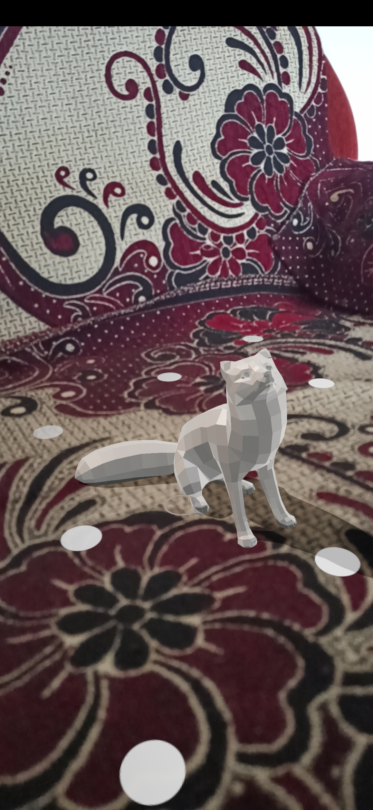
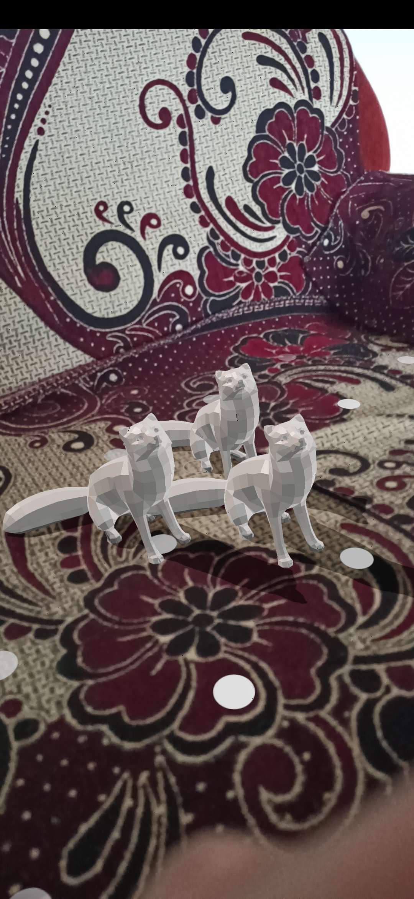
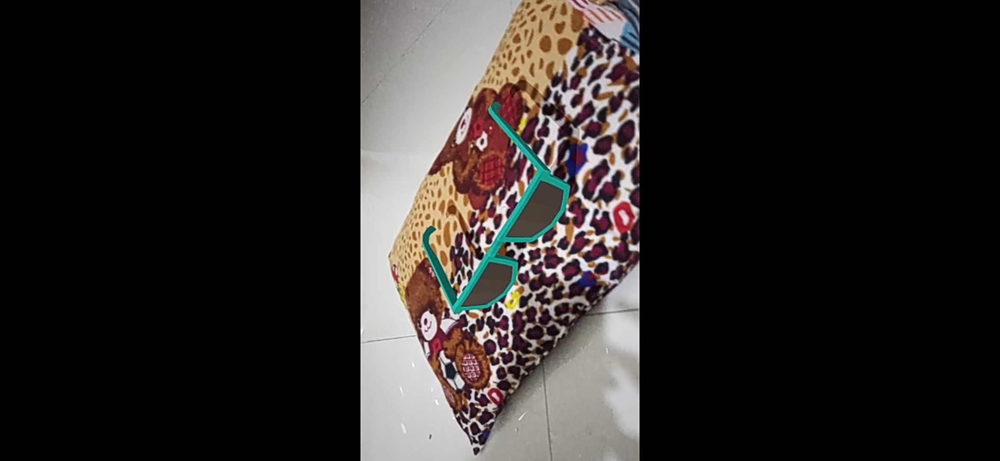

# AR_Basic
implement basic AR feature (show 3D object on Ar Scene) in an android app
# Tech Stack
Android SDK 
Java 
Sceneform SDK 

# Screenshots
 
<b>Single Object(fox)</b>

<b>Multiple Objects</b>

<b>Glasses</b>

